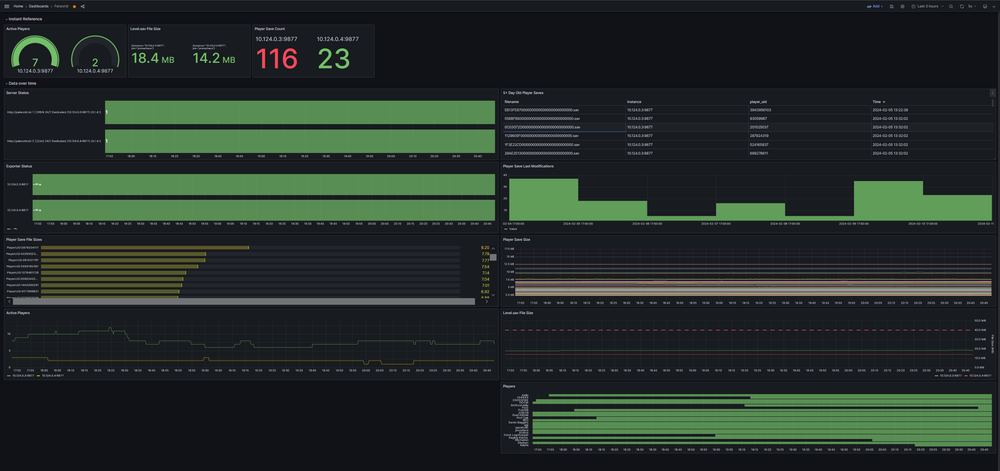

# Prometheus Exporter for Palworld Server

*Developed by https://palworld.lol/*


Here is a screenshot of what's possible to graph using metrics from this exporter. This is for two different Palworld servers:



---
This project contains a [Prometheus Exporter](https://prometheus.io/docs/instrumenting/exporters/) for [Palworld](https://store.steampowered.com/app/1623730/Palworld/) servers to monitor the following metrics:

| name | description | labels | metric type |
|------|-------------|--------|-------------|
| `palworld_player_count` | The current number of players on given server | no extra labels | Gauge |
| `palworld_player` | A player currently logged into the server | Character name, Player UID, and Steam ID | Gauge |
| `palworld_server_info` | Server Information | Server name, Version | Gauge |
| `palworld_up` | Indicator if last metric scrape was successful | no extra labels | Gauge |
| `palworld_player_save_count` | Number of player save files on disk. Only included if `--save-directory` specified. | no extra labels | Gauge |
| `palworld_player_save_size_bytes` | File size of a player save file in bytes | filename and player UID | Gauge
| `palworld_player_save_mtime` | Last modified time of a player save file | filename and player UID | Gauge
| `palworld_level_save_size_bytes` | File size of Level.sav in bytes | no extra labels | Gauge

*For more information of [Gauges see here](https://prometheus.io/docs/concepts/metric_types/#gauge).*

# Options

```shell
$ palworld_exporter --help
Usage: palworld_exporter [OPTIONS]

Options:
  --rcon-host TEXT                RCON hostname or IP address  [default:
                                  localhost]
  --rcon-port INTEGER             RCON Port  [default: 25575]
  --rcon-password TEXT            RCON password  [default: (None)]
  --listen-address TEXT           Hostname or IP Address for exporter to
                                  listen on  [default: 0.0.0.0]
  --listen-port INTEGER           Port for exporter to listen on  [default:
                                  9877]
  --save-directory DIRECTORY      Path to directory contain all .sav files
                                  (e.g. Pal/Saved/SaveGames/0/2FCD4.../)
  --log-level [NOTSET|DEBUG|INFO|WARNING|ERROR|CRITICAL]
                                  Set logging level  [default: INFO]
  --ignore-logging-in             Ignore players actively logging in that
                                  temporarily have no Player UID
  --help                          Show this message and exit.
```

Environment Variables are also available for each option above:

- `RCON_HOST`
- `RCON_PORT`
- `RCON_PASSWORD`
- `LISTEN_ADDRESS`
- `LISTEN_PORT`
- `SAVE_DIRECTORY`
- `LOG_LEVEL`
- `IGNORE_LOGGING_IN`

# Run as Container

## Just Docker

Below is the command to run straight with docker (podman works too!). 

*NOTE*: You will need to make sure the exporter can reach the Palworld server you wish to monitor.

```
docker run -e RCON_HOST=palworld -e RCON_PASSWORD=topsecrt -p 9877:9877 --rm -it docker.io/bostrt/palworld-exporter
```

## Docker Compose

Here is an EXAMPLE docker compose file that uses a https://github.com/thijsvanloef/palworld-server-docker great containerization of Palworld:

⚠️ *Note*: PLEASE check the README on https://github.com/thijsvanloef/palworld-server-docker and don't just copy paste this. 

- Notice the `RCON_PASSWORD` and `ADMIN_PASSWORD` match. 
- Notice the exporter references `palworld`, the name of the Docker compose service.
- Notice the `RCON_PORT` in both services match.

```yaml
services:
  exporter:
    image: docker.io/bostrt/palworld-exporter:latest
    restart: unless-stopped
    container_name: exporter
    ports:
      - 9877:9877/tcp
    depends_on:
      - palworld
    environment:
      - RCON_HOST=palworld
      - RCON_PORT=25575
      - RCON_PASSWORD=top-secret
  palworld:
      image: docker.io/thijsvanloef/palworld-server-docker:latest
      container_name: palworld-server
      ports:
        - 8211:8211/udp
        - 27015:27015/udp
      environment:
         - PUID=1000
         - PGID=1000
         - PORT=8211
         - PLAYERS=16
         - MULTITHREADING=true
         - RCON_ENABLED=true
         - RCON_PORT=25575
         - ADMIN_PASSWORD=top-secret
      volumes:
         - ./palworld:/palworld/:z
```

# Example metric output
```
# HELP palworld_server_info Palworld server information
# TYPE palworld_server_info gauge
palworld_server_info{name="My Palworld",version="0.1.4.1"} 1.0
# HELP palworld_player_count Current player count
# TYPE palworld_player_count gauge
palworld_player_count 2.0
# HELP palworld_player Palworld player information
# TYPE palworld_player gauge
palworld_player{name="vince",player_uid="326323370",steam_id="2222222"} 1.0
palworld_player{name="shlomi",player_uid="1965487011",steam_id="333333"} 1.0
# HELP palworld_player Palworld player information
# TYPE palworld_player gauge
# HELP palworld_up Was the last scrape of RCON successful
# TYPE palworld_up gauge
palworld_up 1.0
# HELP palworld_player_save_size_bytes File size of a player save file in bytes
# TYPE palworld_player_save_size_bytes gauge
palworld_player_save_size_bytes{filename="13734CAA000000000000000000000000.sav",player_uid="326323370"} 2638.0
palworld_player_save_size_bytes{filename="37BE91CC000000000000000000000000.sav",player_uid="935236044"} 2663.0
palworld_player_save_size_bytes{filename="7526F3A3000000000000000000000000.sav",player_uid="1965487011"} 4360.0
palworld_player_save_size_bytes{filename="A1A9AEC2000000000000000000000000.sav",player_uid="2712252098"} 2786.0
# HELP palworld_player_save_mtime Last modified time of a player save file
# TYPE palworld_player_save_mtime gauge
palworld_player_save_mtime{filename="13734CAA000000000000000000000000.sav",player_uid="326323370"} 1.707372037e+09
palworld_player_save_mtime{filename="37BE91CC000000000000000000000000.sav",player_uid="935236044"} 1.707372041e+09
palworld_player_save_mtime{filename="7526F3A3000000000000000000000000.sav",player_uid="1965487011"} 1.707372047e+09
palworld_player_save_mtime{filename="A1A9AEC2000000000000000000000000.sav",player_uid="2712252098"} 1.707372051e+09
# HELP palworld_player_save_count Number of player save files
# TYPE palworld_player_save_count gauge
palworld_player_save_count 4.0
# HELP palworld_level_save_size_bytes File size of Level.sav in bytes
# TYPE palworld_level_save_size_bytes gauge
palworld_level_save_size_bytes 7.711697e+06
```

# Visualization (Grafana)

If you already have a Promtheus + Grafana monitoring setup, you can integrate the metris for some pretty graphs. Here is a very basic Grafana dashboard you can import: https://grafana.com/grafana/dashboards/20421-palworld/.
