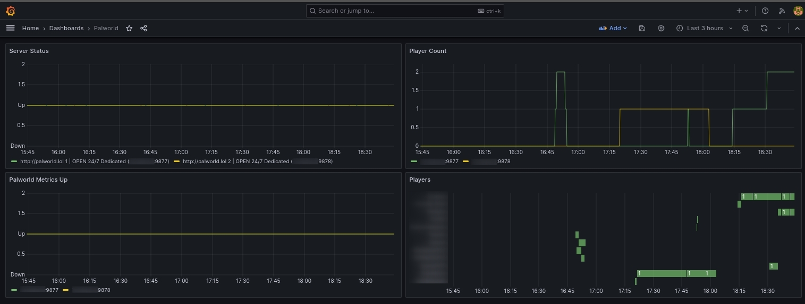

# Prometheus Exporter for Palworld Server

This project contains a [Prometheus Exporter](https://prometheus.io/docs/instrumenting/exporters/) for [Palworld](https://store.steampowered.com/app/1623730/Palworld/) servers to monitor the following metrics:

| name | description | labels | metric type |
|------|-------------|--------|-------------|
| `palworld_player_count` | The current number of players on given server | no extra labels | Gauge |
| `palworld_player` | A player currently logged into the server | Character name, Player UID, and Steam ID | Gauge |
| `palworld_up` | Indicator if last metric scrape was successful | no extra labels | Gauge |

*For more information of [Gauges see here](https://prometheus.io/docs/concepts/metric_types/#gauge).*

# Visualization (Grafana)

If you already have a Promtheus + Grafana monitoring setup, you can integrate the metris for some pretty graphs. Here is a screenshot of some very basic graphs of each metric using two different Palworld servers:

